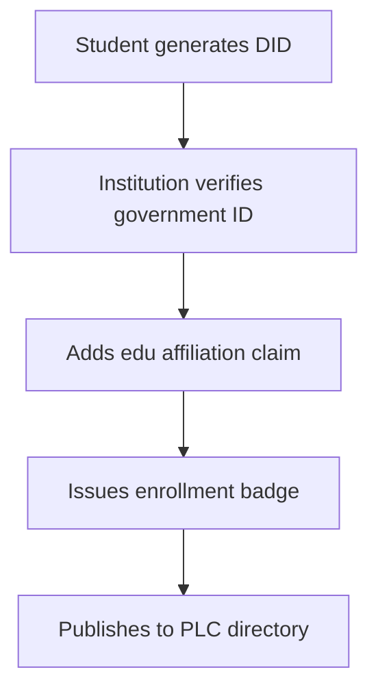

# Integrating the AT Protocol with Open Badges for Decentralized Educational Platforms

---

The convergence of decentralized identity systems and verifiable credentials represents a paradigm shift in educational technology. This report examines the technical and conceptual foundations for building an educational platform that integrates the Authenticated Transfer Protocol (AT Protocol) with Open Badges 3.0, addressing badge issuance workflows, decentralized identity management, and federated data migration.

---

## Architectural Foundations of the AT Protocol

### Decentralized Identity Infrastructure

The AT Protocol reimagines social networking architectures by decoupling user identities from specific platforms. At its core lies the **PLC.Directory**, a decentralized public key infrastructure that maps human-readable identifiers (e.g., `@user.example`) to cryptographic public keys[^4]. Unlike traditional systems where platforms control namespace allocation, AT Protocol identities are self-sovereign—users maintain exclusive control through private key ownership.

This identity layer enables three critical features for educational platforms:

1. **Portable learner profiles** independent of institutional boundaries
2. **Cryptographically verifiable authorship** of educational content
3. **Interoperable credential recognition** across federated instances

### Federation Through Lexicon Schemas

AT Protocol's Lexicon system provides a schema definition language that enables cross-platform interoperability while preserving instance-specific customization[^4]. Educational platforms can implement extended schemas for:

- **Competency frameworks** aligned with regional accreditation standards
- **Badge issuance metadata** compliant with Open Badges 3.0 specifications[^6]
- **Learning record stores** compatible with xAPI and CALIPER

The federation model allows institutions to maintain unique pedagogical approaches while participating in a global network of credential verification.

---

## Open Badges 3.0 in Decentralized Ecosystems

### Evolution to Verifiable Credentials

Open Badges 3.0 represents a significant architectural shift by adopting the W3C Verifiable Credentials data model[^6]. Key enhancements include:

- **Decentralized identifiers (DIDs)** for issuers and recipients
- **Linked Data Proofs** using Ed25519 or BBS+ signature suites
- **Selective disclosure** capabilities for privacy-preserving verification

A badge issued under this specification contains six mandatory components:

1. **Issuer DID** (Decentralized Identifier)
2. **Recipient DID**
3. **Achievement metadata** (alignment with frameworks like ESCO or O*NET)
4. **Evidence records** (URLs to project artifacts or assessment results)
5. **Cryptographic proof chain**
6. **Revocation registry pointer**

### Badge Connect API Integration

The Badge Connect API specification provides OAuth 2.0 endpoints for[^1]:

- **Credential issuance** with scope-based permissioning
- **Verification workflows** supporting both online and offline modes
- **Endorsement management** for third-party validations
- **Revocation status** checks via distributed hash tables

When integrated with AT Protocol repositories, this API enables:

```python
# Example badge issuance workflow using AT Proto identities
def issue_badge(recipient_did, achievement_uri):
    issuer = resolve_did(config.ISSUER_DID)
    credential = create_credential(
        issuer=issuer,
        recipient=recipient_did,
        achievement=load_achievement(achievement_uri),
        proof_type="Ed25519Signature2020"
    )
    post_to_badge_api(credential)
    update_revocation_registry(credential.id)
```

---

## Federated Data Migration Architecture

### Cross-Instance Repository Synchronization

AT Protocol's data migration model uses **commit-chain replication** rather than traditional database dumps. Each user action generates a cryptographically signed commit stored in a Merkle DAG (Directed Acyclic Graph). When migrating between instances:

1. **Export phase**: Source instance generates a .car file containing all repository commits
2. **Validation phase**: Target instance verifies commit signatures against PLC.Directory records
3. **Import phase**: Commits are replayed to reconstruct user state

This approach preserves:

- **Temporal consistency** of learning records
- **Provenance chains** for earned credentials
- **Access control lists** for private content


### Credential Portability Challenges

While Open Badges contain issuer signatures, federated migration introduces three verification scenarios:


| Scenario | Verification Method | Performance Impact |
| :-- | :-- | :-- |
| Origin server online | Direct signature check | 50-100ms latency |
| Origin server offline | DID-based proof verification | 150-300ms latency |
| Cross-federation | PLC resolution + proof chaining | 500ms-2s latency |

Educational platforms must implement **hybrid verification strategies** using:

- **Local credential caches** with TTL policies
- **Distributed proof validation** networks
- **Blockchain-anchored timestamps** for non-repudiation

---

## Implementation Considerations

### Identity Lifecycle Management

The AT Protocol's identity system requires institutions to handle:

**Enrollment workflows:**



**Key rotation policies:**

- Quarterly automatic rotation for staff credentials
- Event-triggered rotation (security incidents)
- Grace periods for credential re-verification


### Compliance Frameworks

Integrating Open Badges with AT Protocol requires alignment with:

1. **GDPR Article 17** (Right to Erasure) via cryptographic tombstoning
2. **FERPA** requirements through zero-knowledge encryption of student records
3. **WCAG 2.2** accessibility standards in badge visual designs[^2]
4. **NIST SP 800-63B** authentication assurance levels

---

## Future Directions and Challenges

### Emerging Technical Barriers

1. **Storage replication costs** for evidence artifacts
2. **Quantum resistance** of current signature schemes
3. **Cross-chain interoperability** for blockchain-backed credentials
4. **Governance models** for federated schema updates

### Recommended Implementation Pathway

**Phase 1:**

- Deploy AT Protocol identity provider
- Implement Open Badges 3.0 issuer node
- Conduct limited pilot with staff credentials

**Phase 2:**

- Integrate Badge Connect API with existing LMS
- Establish cross-institution verification pacts
- Develop migration tools for legacy credentials

**Phase 3:**

- Deploy decentralized storage for evidence artifacts
- Implement machine-readable endorsement graphs
- Participate in global credential exchange networks

---

## Conclusion

The synthesis of AT Protocol and Open Badges 3.0 creates an educational infrastructure that is both institutionally autonomous and globally interoperable. By leveraging decentralized identifiers, cryptographic verification, and federated data models, institutions can issue credentials that remain valid across organizational and national boundaries.

Successful implementation requires careful attention to:

- **Cryptographic key lifecycle management**
- **Hybrid verification architectures**
- **Compliance-aware schema design**
- **Gradual migration pathways** for legacy systems

As these technologies mature, they promise to create an educational landscape where learner achievements are truly portable across political and technological borders while maintaining rigorous academic standards.

<div style="text-align: center">⁂</div>

[^1]: https://www.1edtech.org/standards/open-badges

[^2]: https://www.verifyed.io/blog/customize-badges

[^3]: https://abstract-technology.de/migration

[^4]: https://www.comparitech.com/blog/vpn-privacy/what-is-at-protocol/

[^5]: https://sertifier.com/blog/digital-badges-for-students/

[^6]: https://www.imsglobal.org/spec/ob/v3p0

[^7]: https://professionalstudies.syracuse.edu/wp-content/uploads/2023/12/SU-Digital-Badging-Standards-20230523.pdf

[^8]: https://whtwnd.com/bnewbold.net/3l5ii332pf32u

[^9]: https://everycred.com/blog/decentralized-identity-and-open-badges-in-education/

[^10]: https://hackernoon.com/migrating-user-handles-and-pds-on-bluesky-with-at-protocols-decentralized-ids

[^11]: https://www.youtube.com/watch?v=IJdJZftt17s

[^12]: https://www.accredible.com/blog/when-and-how-to-issue-digital-badges

[^13]: https://carlacasilli.wordpress.com/2014/03/17/a-foundational-badge-system-design/

[^14]: https://docs.bsky.app/docs/advanced-guides/atproto

[^15]: https://atproto.com/guides/overview

[^16]: https://indicio.tech/why-use-decentralized-identity-and-open-badges-in-education/

[^17]: https://www.hrk.de/resolutions-publications/resolutions/beschluss/detail/micro-degrees-and-badges-as-formats-of-supplementary-digital-credentials/

[^18]: https://www.itcilo.org/digital-badges

[^19]: https://github.com/WebOfTrustInfo/rwot6-santabarbara/blob/master/final-documents/open-badges-are-verifiable-credentials.md

[^20]: https://expressbadging.com/id-badge-design-guidelines-2/

[^21]: https://www.content2classroom.com/platform-migration

[^22]: https://hochschulforumdigitalisierung.de/sites/default/files/dateien/HFD_AP_Nr48_Open_Badges_Bericht_2019_EN_web.pdf

[^23]: https://www.howtogeek.com/what-is-blueskys-at-protocol-and-how-can-it-improve-social-media/

[^24]: https://www.imsglobal.org/spec/ob/v3p0/impl

[^25]: https://hypeathletics.org/2025/01/09/the-best-way-to-implement-a-profitable-id-badge-system-at-work/

[^26]: https://www.protocol-education.com/blog/2024/10/introducing-our-new-cpd-academy

[^27]: https://community.canvaslms.com/t5/The-Product-Blog/Unlock-the-Future-of-Digital-Credentialing-with-Open-Badges-3-0/ba-p/605250

[^28]: https://www.cosmico.org/integrating-activitypub-with-atproto/

[^29]: https://github.com/mozilla/openbadges-backpack

[^30]: https://essay.utwente.nl/75199/1/Thesis Frank Brinkkemper.pdf

[^31]: https://daily.dev/blog/10-open-source-badge-platforms-for-community-managers

[^32]: https://ec.europa.eu/programmes/erasmus-plus/project-result-content/28899d97-c869-4009-9270-3e137fe9aa72/PAST_TIMES_Open_Badges_Framework.docx.pdf

[^33]: https://decentralized-id.com/application/education/

[^34]: https://atproto.com/guides/account-migration

[^35]: https://openbadges.education/public/start

[^36]: https://intarch.ac.uk/about/open-badges/

[^37]: https://www.virtualbadge.io/blog-articles/is-blockchain-technology-for-digital-certificates-and-badges-threatening-your-business-or-institution

[^38]: https://www.ionos.com/digitalguide/server/configuration/server-migration-transfer-without-data-loss/

[^39]: https://www.1edtech.org/standards/open-badges/badging-considerations

[^40]: https://openbadges.org/Issue

[^41]: https://www.bildung-forschung.digital/digitalezukunft/de/bildung/initiative-digitale-bildung/open_educational_badges/open_educational_badges_node.html

[^42]: https://ej-edu.org/index.php/ejedu/article/view/841

[^43]: https://github.com/bluesky-social/atproto/discussions/1621

[^44]: https://atproto.com

[^45]: https://territorium.com/open-badges-3-0-new-capabilities-and-use-cases-for-digital-credentialing/

[^46]: https://www.surf.nl/files/2019-06/Whitepaper-on-open-badges-en-micro-credentials.pdf

[^47]: https://www.parchment.com/platform/international/global-issuing/digitary-services-badges/

[^48]: https://www.uni-goettingen.de/en/digital+badges/+digital+proofs+of+competence/604560.html

[^49]: https://epale.ec.europa.eu/en/blog/open-badges-recognising-informal-learning

[^50]: https://files.eric.ed.gov/fulltext/EJ1212520.pdf

[^51]: https://blogs.iadb.org/conocimiento-abierto/en/open-badges-can-help-showcase-recognized-professional-competencies-2/

[^52]: https://openbadges.org

[^53]: https://news.uni-goettingen.de/blog/2024/02/01/digital-badges-an-der-universitaet-goettingen-digital-badges-at-goettingen-university/

[^54]: https://badge.wiki/wiki/Getting_Started

[^55]: https://www.thebadge.xyz/en/oracle

[^56]: https://hal.science/hal-04050310v2/document

[^57]: https://www.komprise.com/glossary_terms/smb-data-migrations/

[^58]: https://www.linkedin.com/pulse/verifiable-credentials-open-badges-30-whats-changed-doug-belshaw

[^59]: https://www.zbw-mediatalk.eu/2022/03/open-badges-meaningful-credential-for-continuing-education-in-libraries/

